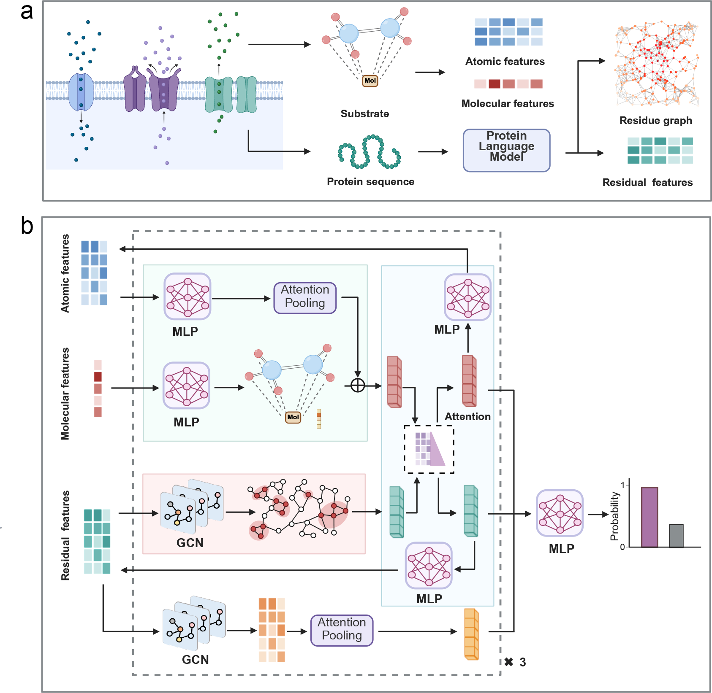

# Inferring transporter specificity through language model–guided graph learning


## Background

Here, we present TraSPIN, a generalizable Transporter Specificity Inference Network that enables accurate prediction of specific substrates for transport proteins. TraSPIN is a geometric deep learning framework that jointly models paired representations of transporter proteins and small-molecule substrates.



## Installation
TraSPIN is implemented using Python 3.9.12 and various scientific computing packages (numpy, biopython, scikit-learn, torch). We recommend creating a dedicated virtual environment and installing the same package versions.

```
conda env create -f environment_gpu.yml
```

Alternatively, command lines can be helpful in setting up the environment (tested on linux with python 3.9), this can be done in few lines using Anaconda (https://www.anaconda.com).

```
conda create --name turnover python=3.9
conda activate turnover
conda install pytorch==1.11.0 torchvision==0.12.0 torchaudio==0.11.0 -c pytorch 
```

KcatNet utilizes pre-trained protein language model protT5 and ESM for protein residual embedding and evolutionary information extraction. 

(1) Install protT5

```
pip install transformers 
```

(2) Install ESM

```
pip install "fair-esm"
```
Note: The language model protT5 (referring to https://github.com/agemagician/ProtTrans) can also be downloaded for offline use.

We also included a pretrained molecular language modoel SMILES Transformer to generate substrate representation, the link is also provided on  [SMILES Transformer](https://github.com/DSPsleeporg/smiles-transformer).


## Training from scratch to predict specificity of transporters

The script train_specificity.py can be utilized to train a model to predict the specificity of transporter given a transporter sequence and substrate SMILE pair:

```
python train_specificity.py 
```

## ## Training from scratch to predict substrate class of transporters
transporter substrate class datasets used for model development and evaluation are provided in the ./data folder. The model can be trained from scratch via:

```
python train_substrate_class.py
```

## Contact
For any question and comment regarding the code, please reach out to
tong.pan@adelaide.edu.au
